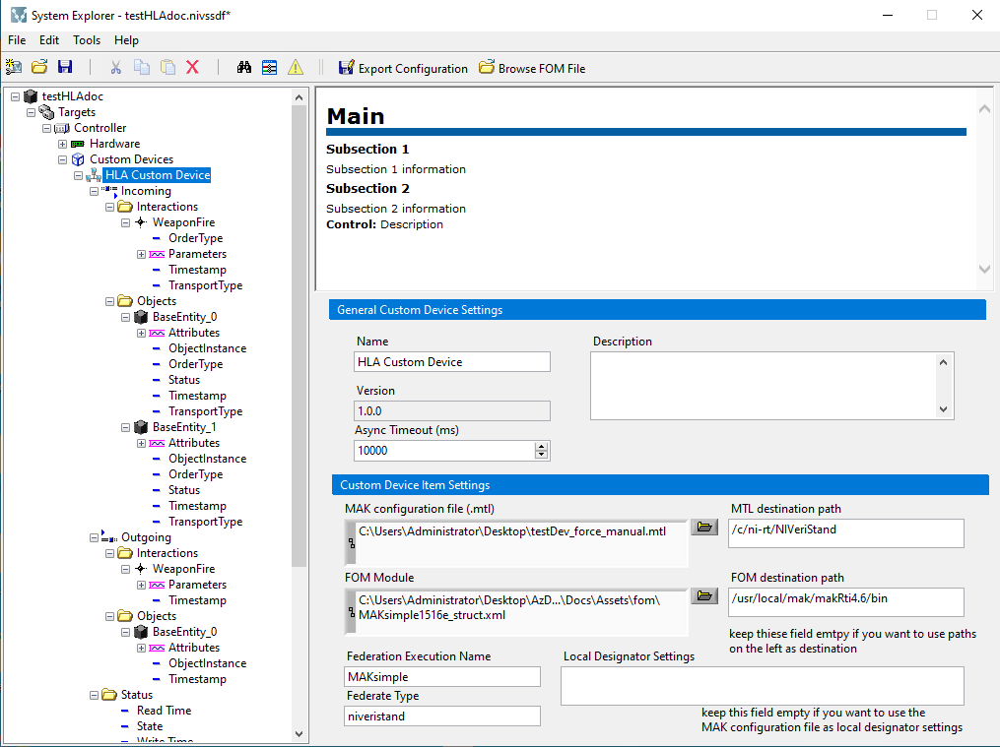

# Using the HLA Custom Device Custom Device

This guide demonstrates how to configure and deploy the HLA Custom Device custom device. After having properly configured the [RTI](https://en.wikipedia.org/wiki/Run-time_infrastructure_(simulation)) of your HLA federation, you can use your system as a federate through this custom device.

## Configure RTI (Run Time Infrastructure)

The custom device turn your system into a HLA Federate, which requires an RTI (Run Time Infrastructure) to connect to. Each RTI vendor implements has its own process and tools to use, and we report here below a section for each vendor that we have tested so far.

The goal of this configuration is to provide the so called *local settings designator string* to connect your system to the HLA federation through the custom device. 
 
### MAK 

The [MÄK High Performance RTI](https://www.mak.com/mak-one/infrastructure/mak-rti#the-mak-rti-unlicensed-mode-allows-limited-free-use) uses .mtl files to configure the connection to the RTI. For the custom device that we are using here there is a sample file found in `Docs/Assets/mtl/testDev_force_manual.mtl` where you should edit the following line:

```
(setqb RTI_tcpForwarderAddr "10.100.1.22")
```

with 

```
(setqb RTI_tcpForwarderAddr "<IP of the Machine with RTI forwarder/rtiexec>")
```

Refer to the MAK documentation (e.g. the RTIx.yUsersGuide.pdf) to get more information about how to work with MTL (MAK Technologies Lisp) files.

## Configure the Custom Device

This guide shows two options for configuring the custom device:
- Configure the Custom Device in System Explorer
- Load object and interactions to share data inside the HLA federation

### Configure the Custom Device in System Explorer

1. Create a new VeriStand Project and configure your PXI Linux RT target.
2. Navigate to the `Targets\Controller\Hardware\Custom Devices` entry in the tree.
3. Right-click the **Custom Devices** entry and add a new instance of the **HLA Custom Device** custom device.
4. Select *New Custom Device Instance* if you want to create a custom device from scratch or *Load Custom Device Configuration from File* if you want to load a previously exported configuration.
5. Use the Main Page to set the following required parameters:
  - **MAK configuration file (.mtl)** : the .mtl with the configuration parameters to connect to the MAK rti.
  - **FOM Module** : the FOM xml file.
  - **Federation  Execution Name** : The federation execution that you want to create/join.
  
  

6. Right-click on the Main Page and select **Browse FOM File**

7. Click the browse button from the *FOM export information file (.json)* and select one of the .json file at `Docs\Assets` folder.


8. Press *Load* button to have a preview of the objects / interactions that will be loaded. To effectively apply your selection to the system explorer, you have to press the **OK** button to exit.



### Load object and interactions to share data inside the HLA federation

Object and interactions can be loaded into the custom devices through a .json file that is derived from the information included in the FOM xml file. At the current release, .json file has to be filled manually or through some json scripting.
The structure of the json file is the following:

```json
{
  "publish":
  {
    "objects": [
      {
        "name": "Aircraft",
        "attributes": [
          {
            "name": "Coordinates",
            "type": "fixed_coords"
          }
        ],
        "instanceId": 0
      }
    ],
    "interactions": [
      {
        "name": "WeaponFire",
        "parameters": [
          {
            "name": "FuseType",
            "type": "HLAfloat64BE"
          },
          {
            "name": "RateOfFire",
            "type": "HLAfloat64BE"
          }
        ]
      }
    ]
  },
  "subscribe":
  {
    "objects": [
      {
        "name": "Aircraft",
        "attributes": [
          {
            "name": "Coordinates",
            "type": "fixed_coords"
          }
        ],
        "instanceId": 0
      }
    ],
    "interactions": [
      {
        "name": "WeaponFire",
        "parameters": [
          {
            "name": "FuseType",
            "type": "HLAfloat64BE"
          },
          {
            "name": "RateOfFire",
            "type": "HLAfloat64BE"
          }
        ]
      }
    ]
  }
}
```
- *publish* : the section where to put all interactions or object that you want to publish to the HLA federation
- *subscribe* : the section where to put all interactions or object that you want to subscribe from the HLA federation
- *objects* : section containing hla objects
- *interactions* : section containing hla interactions 
- *parameters* : array of parameter json objects
- *attributes* : array of attribute json objects
- *name* : name of the parameter/attribute/object or interaction
- *type* : type of parameter / attribute: it must reflect the same type as written in the FOM. At the moment, these are the data types currently supported:
  - HLAfloat64BE : float64, Big-Endian
  - fixed_coords : this is a test staticRecord type with 6 HLAfloat64BE identifying coordinates of the object. See the `Docs/Assets/fom/MAKsimple1516e_struct.xml` for more details. 
- *instanceId* : for objects, it's a 0-based index that must be incremented depending on how many objects instances you want to publish or subscribe to. This is the maximum number of instances that the custom device caan handle in parallel.

## Deploy the System Definition

After configuring the System Definition with the custom device, deploy the System Definition using VeriStand. Once the deployment state reaches **Connected**, use a VeriStand screen to display the custom device inputs and outputs. This example uses VeriStand 2020 R6, so your screen controls may behave differently depending on version.

1. Open a VeriStand Screen
2. Highlight the **System Definition** tree in the left rail
3. Expand the tree to `Targets\Controller\Hardware\Custom Devices\HLA Custom Device\CH00`
4. Expand the **Incoming** to see data to which your federate has been subscribed to and **Outcoming** for the data that you're publishing
5. Select the Objects or interactions that you want to see onto the screen


## Modifying the Custom Device Configuration

Once the custom device is configured, you can change the configuration by right-clicking the Main page in System Explorer and select **Browse FOM File**. The new json file that you will load will replace the existing configuration entirely.
